## Step 1: Set Up Environment ##
**Install Python:** Make sure you have Python installed on your system. You can download it from the official Python website. Ensure you select the option to add Python to your system PATH during installation.

**Install Virtual Environment (Optional):** 
```
pip install virtualenv
```         
## Step 2: Create a simple Django Project
a) Create a Directory: Create a directory for your Django project.
```         
mkdir django_project
cd django_project
```         

b) Create Virtual Environment (Optional): If you choose to use a virtual environment, create one inside your project directory.
```         
virtualenv venv
```         

c) Activate Virtual Environment (Optional): Activate the virtual environment.
On Windows:
```         
venv\Scripts\activate
```         
On macOS/Linux:
```         
source venv/bin/activate
```         
d) Install Django: Install Django using pip.
```         
pip install django
```         

e) Create Django Project: Use the Django CLI to create a new project.
```         
django-admin startproject myproject
```         
f) Create Django App: Navigate into your project directory and create a Django app.
```         
cd myproject
python manage.py startapp myapp
```         

## Step 3: Develop Simple Feature
Create Views: Define views to handle requests and render templates in views.py within your app directory (myapp/views.py).
```         
from django.http import HttpResponse

def index(request):
    return HttpResponse("Hello, Welcome to My Page!")
```         

## Step 4: Run Development Server
Run Development Server: Start the Django development server.
```         
python manage.py runserver
```         

**Test Your Application:** Open a web browser and go to http://localhost:8000 to see your Django app in action.

That's it! You've now created a simple Django web application.


## Prerequisites
This assumes you have knowledge on Jenkins and you have run some Jenkins CI/CD pipeline before. Also, before you start working on this project, you need to have the following:

**Docker Desktop** – We will use Docker to build and run Jenkins as a Docker Container.
**GitHub account** – You will use GitHub as your Source Code Management (SCM) Git repository. You will push your Jenkinsfile, application, and deployment files to your GitHub repository.
**Kubernetes Cluster** – A Kubernetes cluster is a collection of interconnected computing resources, often consisting of multiple physical or virtual machines, that are orchestrated and managed collectively by the Kubernetes platform.
Kubernetes is an open-source container orchestration system that automates the deployment, scaling, management, and operation of containerized applications.
A cluster provides an environment where containers, which encapsulate application code and dependencies, can be efficiently managed and orchestrated for optimal performance, reliability, and scalability.
In this we will use the **Minikube Kubernetes Cluster**. It is the most popular local Kubernetes cluster. We will use Minikube since it’s free to use and easy to set up on your computer.

**Kubectl** – It is the command line tool interface for Kubernetes. It allows DevOps practitioners to run commands and deploy Kubernetes objects to the Kubernetes cluster. 
**Docker Hub account** – Jenkins CI/CD Pipeline will build the Docker image and push it to your Docker Hub repository. It will also pull the Docker image from the Docker Hub registry and create a containerized application.
## Containerize django application:- 
1) Create a Dockerfile in a directory for your project(as I have provided a file named Dockerfile)
2) Create a Kubernetes Deployment YAML file
A Kubernetes Deployment YAML file creates the pods for the django python application container in the Kubernetes cluster. The pods will host the application container, and each pod will have the necessary Kubernetes resources. In the `django_project` folder, create a `deployment.yml` file.
The deployment.yaml file above will create 1 pods in the Kubernertes application. It will pull Docker image from the Docker Hub repository and create a containerized application.
3) Create a Kubernetes Service Deployment YAML file
A Kubernetes Service Deployment YAML file will create a Kubernetes Service in the Kubernetes cluster. The Kubernetes Service will expose the pods for the django python application container outside the Kubernetes cluster. You will use the Kubernetes Service to access the django python application container from outside the Kubernetes cluster. 
4) Create a ingress YAML file 
With this we can access our application via domain name

## Creating Jenkins Container and creating jenkinspipeline :-
Pull Jenkins Docker Image: Pull the official Jenkins Docker image from Docker Hub using the following command:
```         
docker pull jenkins/jenkins
```         

1) **Run Jenkins Container:** Run the Jenkins Docker container with the necessary configurations. You'll typically want to mount a volume to persist Jenkins data and expose ports for accessing the Jenkins web interface. For example:
```         
docker run -d -p 8080:8080 -p 50000:50000 -v jenkins_home:/var/jenkins_home jenkins/jenkins
```         
2) **Access Jenkins Web Interface:** Access the Jenkins web interface by navigating to http://localhost:8080 (if running locally) or <your-server-ip>:8080 in your web browser. Follow the on-screen instructions to complete the Jenkins setup wizard, including initial user creation and plugin installation.


3) **Configure Jenkins Pipeline:** Once Jenkins is set up, create a new Jenkins pipeline project from the Jenkins dashboard. Configure the pipeline to fetch your Django application code from your version control system (e.g., Git), build a Docker image from the code, run automated tests, and deploy the application to your Minikube Kubernetes cluster. You can define this pipeline using a Jenkinsfile stored in your project repository.


4) **Install Required Plugins:** Install any additional Jenkins plugins required for your CI/CD pipeline. For example, you may need plugins for Git integration, Docker integration, Kubernetes deployment, etc.
 
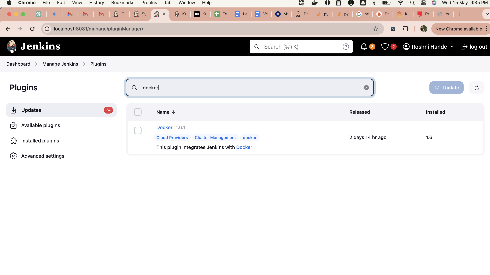


5) **Set Up Jenkins Credentials:** Configure Jenkins credentials for accessing your version control system, Docker registry, Kubernetes cluster, etc. This ensures that Jenkins can securely access external resources during the pipeline execution.


6) **Set Up Dockerhub Credentials:**  Configure dockerhub credentials for accessing your Docker registry and pushing image to that.


7)  **Install Docker inside jenkins conatiner:** using https://faun.pub/how-to-install-docker-in-jenkins-container-4c49ba40b373  

8) **kubernetes(minikube) connect to jenkins** - Configure kubernetes to connect to minikube
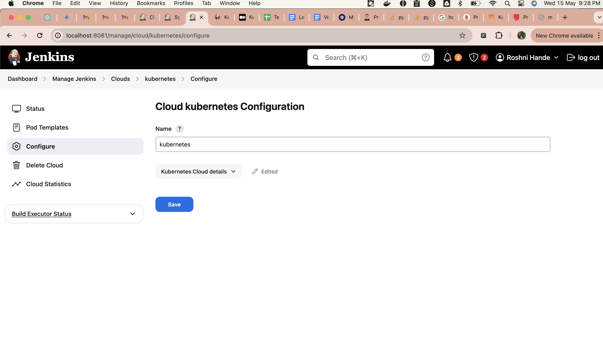

6) **Create a Jenkinsfile:** 
The Jenkinsfile will have multiple stages for defining our CI/CD Jenkins Pipeline. In our project folder, create a Jenkinsfile
The Jenkinsfile will create a Jenkins Pipeline with four stages:

**Checkout Source**


**Adjust Permissions**


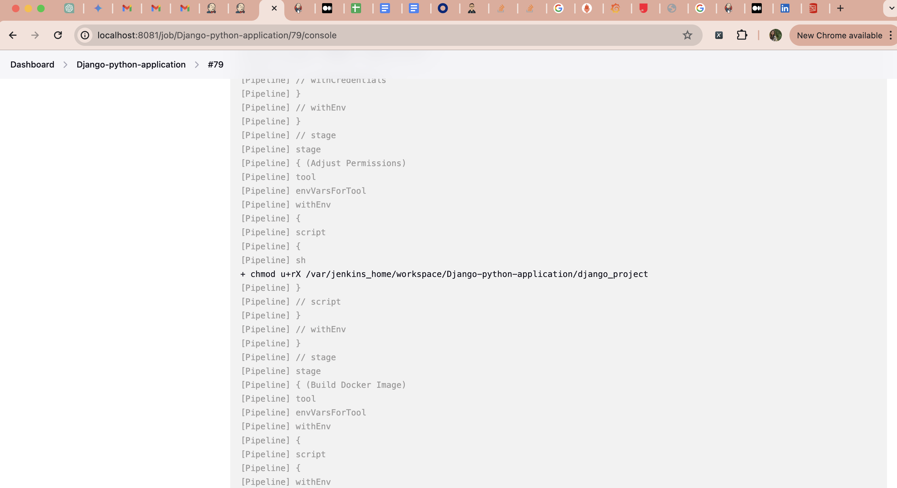


**Build Docker image and push to Dockerhub**


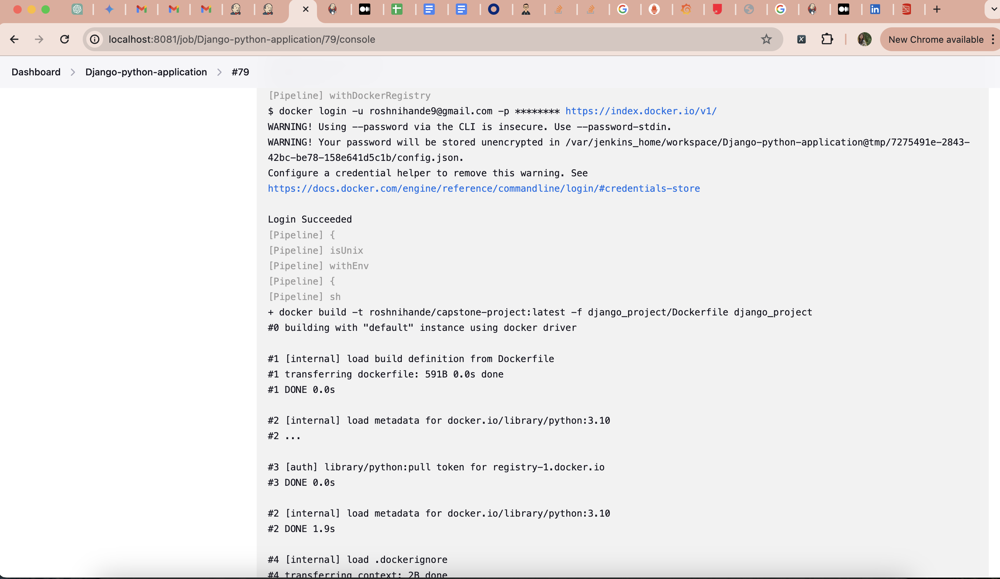
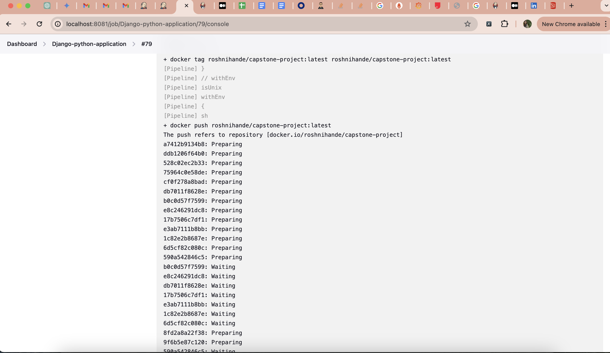
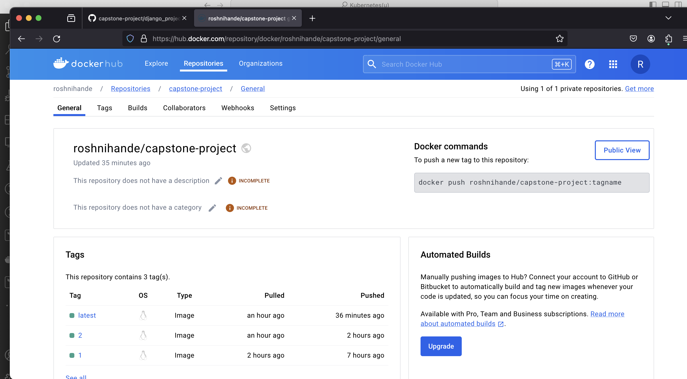


**Deploying app to minikube cluster**


7) **Commit Jenkinsfile to Your Git Repository:** Commit the Jenkinsfile to your Django application's Git repository.


## Accessing the Deployed Dockerized Application
You will use the Kubernetes Service to access the Django application container from outside the Kubernetes cluster. To get the Kubernetes Service, run this command:
```
1) **kubectl get service**
```


2) You will then run the following command to get the URL:
```
minikube service react-app-service
```
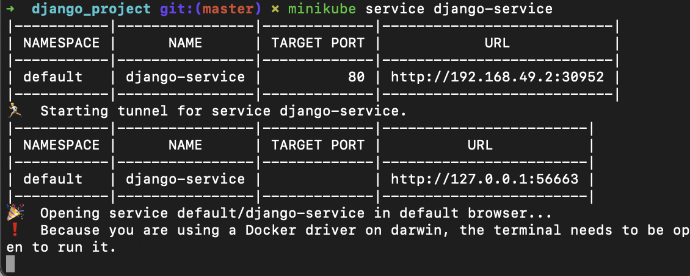

3) Browser will come up and you can access your deployed application


## Access deployed application on browser
1) Create ingress.yml file with host as "myapp.test"
```
kubectl apply f ingress.yml 
```


2) Run this command **sudo nano /etc/hosts** to initialise myapp.test host as 127.0.0.1 IP in /etc/hosts file
3) run "minikube tunnel" command 
4) You can access your aplication via "myapp.test" on browser


## Installing Prometheus and Grafana on minikube cluster
Make sure minikube is up and running

## Install Prometheus
1) Add prometheus repository
```
 helm repo add prometheus-community https://prometheus-community.github.io/helm-charts
```
2) Install provided Helm chart for Prometheus
```
  helm install prometheus prometheus-community/prometheus
``` 
3) Expose the prometheus-server service via NodePort
```
kubectl expose service prometheus-server --type=NodePort --target-port=9090 --name=prometheus-server-np
```
4) Check services:
```
kubectl get svc
```
## Access Prometheus UI
 minikube service prometheus-server-np --url ---> this will open browser
OR 
From lense you can port forward on service "prometheus-server-np" .

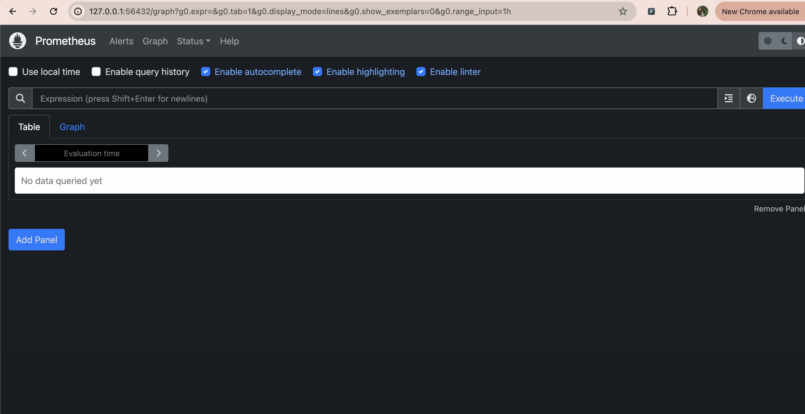

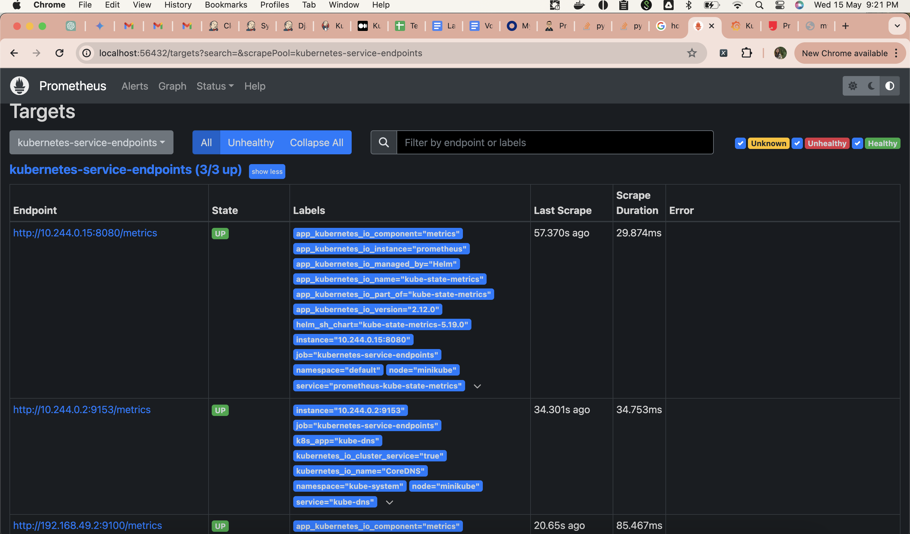

## Install Grafana (https://maxat-akbanov.com/prometheus-and-grafana-setup-in-minikube)
1) Add Grafana Helm repo:
```
helm repo add grafana https://grafana.github.io/helm-charts
```

2) Install Grafana chart:
```
helm install grafana grafana/grafana
```
3) Expose Grafana service via NodePort in order to access Grafana UI
```
kubectl expose service grafana --type=NodePort --target-port=3000 --name=grafana-np
```
4) Check Exposed Service
```
kubectl get services

```
5) Get Grafana admin credentials
```
kubectl get secret --namespace default grafana -o jsonpath="{.data.admin-password}" | base64 --decode ; echo

```
## Access Grafana Web UI
1) Expose Grafana service in minikube
```
minikube service grafana-np --url

```

2) Access UI and enter admin credentials
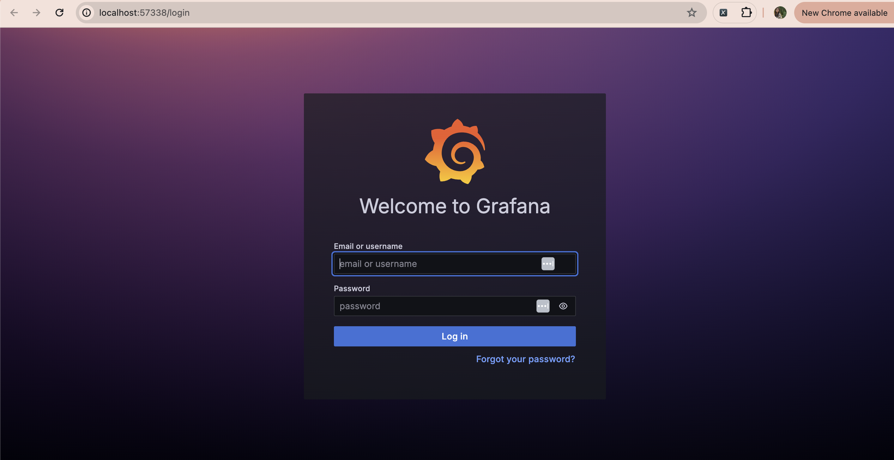

3) Add Prometheus data source (use prometheus-server:80 URL)


4) Import default Prometheus dashboards


## Monitoring dashboard in Grafana


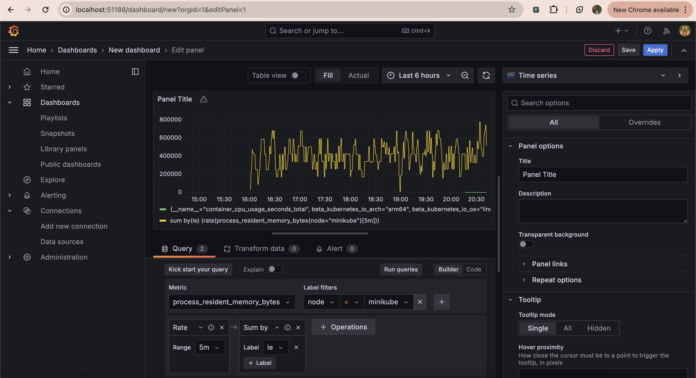


##

